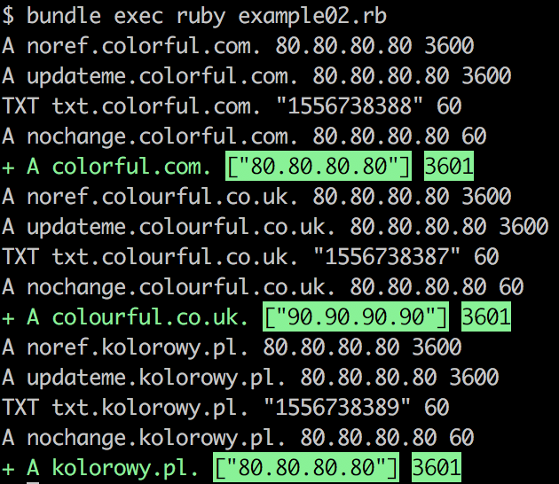
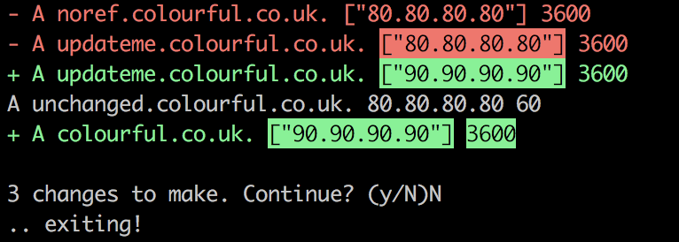
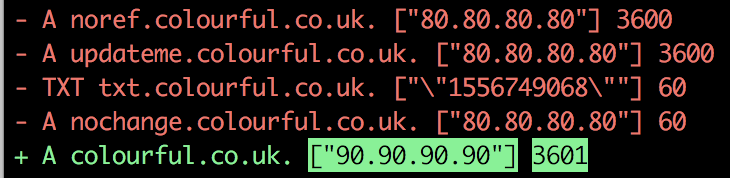

# SprinkleDNS

A diff-based way of managing DNS for people with lots of domains for AWS Route53.

## How

Use plain old Ruby to define your DNS configuration:

```ruby
require 'sprinkle_dns'

client = SprinkleDNS::Route53Client.new(ACCESS_KEY_ID, SECRET_ACCESS_KEY)
sdns   = SprinkleDNS::Client.new(client)

sdns.entry('A', 'www.billetto.com', '88.80.188.142', 360)
sdns.entry('A', 'staging.billetto.com', '88.80.188.143', 360)

sdns.sprinkle!
```

Or a more advanced example using loops and interpolation:

```ruby
require 'sprinkle_dns'

client = SprinkleDNS::Route53Client.new(ACCESS_KEY_ID, SECRET_ACCESS_KEY)
sdns   = SprinkleDNS::Client.new(client)

domains = ['billetto.dk', 'billetto.co.uk', 'billetto.com',  'billetto.se']

domains.each do |domain|
  sdns.entry('A', domain, '88.80.188.142', 360)
  sdns.entry('A', "www.#{domain}", '88.80.188.142', 360)

  s.entry("CNAME", "docs.#{domain}",  'ghs.googlehosted.com', 43200)
  s.entry("CNAME", "mail.#{domain}",  'ghs.googlehosted.com', 43200)
  s.entry("CNAME", "drive.#{domain}", 'ghs.googlehosted.com', 43200)

  s.entry("MX",    domain, ['1 aspmx.l.google.com',
                            '5 alt1.aspmx.l.google.com',
                            '5 alt2.aspmx.l.google.com',
                            '10 aspmx2.googlemail.com',
                            '10 aspmx3.googlemail.com'], 60)
end

# Overwrite one of the domains, to test our new loadbalancer:
sdns.entry('A', 'billetto.com', '89.81.189.143', 360)

sdns.sprinkle!
```

## Configuration

You can configure the `SprinkleDNS::Client` like so:

```ruby
client = SprinkleDNS::Route53Client.new(ACCESS_KEY_ID, SECRET_ACCESS_KEY)
sdns = SprinkleDNS::Client.new(client,
  dry_run: false,
  diff: true,
  show_untouched: false,
  force: true,
  delete: false,
  interactive_progress: true,
  create_hosted_zones: false,
)
```

Here is a table that shows the different configuration options:

| Name                   | Description                                                                                               | Default value |
|------------------------|-----------------------------------------------------------------------------------------------------------|---------------|
| `dry_run`              | Do not make any changes, just compare and exit, useful with `diff: true`.                                 | `true`        |
| `diff`                 | Prints a diff to list the changes that are going to be made.                                              | `true`        |
| `show_untouched`       | Specifies whether or not the diff should show untouched records or not.                                   | `false`       |
| `force`                | Do not ask before changes are made, just apply.                                                           | `false`       |
| `delete`               | Specifies whether unreferenced entries should be deleted.                                                 | `false`       |
| `interactive_progress` | Shows interactive progress whilst changes are being applied, nice for your terminal, not for your CI-job. | `true`        |
| `create_hosted_zones`  | Specifies whether or not hosted zones should be created.                                                  | `false`       |

### `dry_run` and `diff`

`dry_run` is useful combined with `diff` because it will let you see the changes in a safe manner without any changes being applied:



### `force: false`

With `force` being set to `false` you will be asked whether or not you want to apply the changes:



### `delete: true`

With `delete` being set to `true` SprinkleDNS will delete **any** entries not being referenced, these will also show up in the diff (if it is enabled):



### `create_hosted_zones: true`

With `create_hosted_zones` set to `true`, SprinkleDNS will create a hosted zone if not existing, it requires the `route53:CreateHostedZone` permission.

## Support for ALIAS-records

Route53 supports ALIAS-records to achieve CNAME-flattening, SprinkleDNS also supports that, here we point our root domain to an ELB:

```ruby
require 'sprinkle_dns'

client = SprinkleDNS::Route53Client.new(ACCESS_KEY_ID, SECRET_ACCESS_KEY)
sdns   = SprinkleDNS::Client.new(client)

sdns.alias('A', 'billetto.com', 'Z215JYRZR1TBD5', 'dualstack.mothership-test-elb-546580691.eu-central-1.elb.amazonaws.com')

sdns.sprinkle!
```

## Amazon policy

This gem uses the following permissions to manage hosted zones:

- `route53:ListHostedZones`, for getting the list of hosted zones.
- `route53:ListResourceRecordSets`, to read the records for a hosted zone.
- `route53:ChangeResourceRecordSets`, to change records for a hosted zone.
- `route53:GetChange`, for reading when a change have been applied.

Additionally, you can consider adding the following permissions:

- `route53:CreateHostedZone`, for allowing the gem to create hosted zones.

You can allow it for all of your hosted zones:

```json
{
    "Version": "2012-10-17",
    "Statement": [
        {
            "Effect": "Allow",
            "Action": [
                "route53:ListResourceRecordSets",
                "route53:ChangeResourceRecordSets",
                "route53:GetChange",
                "route53:ListHostedZones"
            ],
            "Resource": [
                "*"
            ]
        }
    ]
}
```

For a more "locked down" policy you can use this (remember to update the `resource` array):

```json
{
    "Version": "2012-10-17",
    "Statement": [
        {
            "Effect": "Allow",
            "Action": [
                "route53:ListResourceRecordSets",
                "route53:ChangeResourceRecordSets"
            ],
            "Resource": [
                "arn:aws:route53:::hostedzone/Z3EATJAGJWXQE8"
            ]
        },
        {
            "Effect": "Allow",
            "Action": [
                "route53:GetChange",
                "route53:ListHostedZones"
            ],
            "Resource": [
                "*"
            ]
        }
    ]
}
```

# Obtain certificates with LetsEncrypt

Not everyone is aware of it, but LetsEncrypt allows for a DNS-challenge, this means that if you want to have a certificate for `billetto.com` you can ask certbot to use the DNS-challenge, and run a script:

```bash
certbot --preferred-challenges dns --manual-auth-hook "bash run_my_dns_script.sh"
```

The script `run_my_dns_script.sh` will then recieve two ENV-variables, one for `CERTBOT_DOMAIN` which in our example is `billetto.com` and `CERTBOT_VALIDATION` which is a value that needs to be set in the DNS, so in order to prove to LetsEncrypt that we manage the domain we have to set the following:

```
TXT   _acme-challenge.ENV['CERTBOT_DOMAIN']   ENV['CERTBOT_VALIDATION']
```

Instead of a bash-script, we can use Ruby and SprinkleDNS like so:

```ruby
#!/usr/bin/env ruby
require 'sprinkle_dns'
require_relative '../includes/access_keys'

raise 'ENV-variable CERTBOT_DOMAIN is not supplied' if ENV['CERTBOT_DOMAIN'].nil?
raise 'ENV-variable CERTBOT_VALIDATION is not supplied' if ENV['CERTBOT_VALIDATION'].nil?

c = SprinkleDNS::Route53Client.new(ACCESS_KEY_ID, SECRET_ACCESS_KEY)
s = SprinkleDNS::Client.new(c, interactive_progress: false, diff: false, force: true, delete: false, create_hosted_zones: false)
s.entry('TXT', "_acme-challenge.#{ENV['CERTBOT_DOMAIN']}", %Q{"#{ENV['CERTBOT_VALIDATION']}"}, 60)
s.sprinkle!
```

Save it as `dns_auth.rb`, and remember to chmod it: `chmod +x dns_auth.rb`.

Now you can start on the main script `ssl_certbot.rb`:

```ruby
#!/usr/bin/env ruby
require 'open3'
require 'fileutils'

EMAIL = 'domains@billetto.com'
MAIN_DOMAIN = 'billetto.com'
DOMAINS = ['billetto.dk', 'billetto.co.uk', 'billetto.com']

def run_command(command)
  puts("+: #{command}")

  Open3.popen2e(command) do |stdin, stdout_stderr, wait_thread|
    Thread.new do
      stdout_stderr.each {|l| puts l }
    end
    wait_thread.value
  end
end

def print_guide
  puts "Congratulations, you have a new certificate!"
  puts "----------------------------------------------------------------"
  puts "CERTIFICATE: #{Dir.pwd}/config/live/billetto.com/cert.pem"
  puts "KEY:         #{Dir.pwd}/config/live/billetto.com/privkey.pem"
  puts "CHAIN:       #{Dir.pwd}/config/live/billetto.com/chain.pem"
end

letsencrypt_dirs = ['config', 'work', 'logs']
previous_letsencrypt_run = letsencrypt_dirs.all?{|dir| Dir.exist?(dir)}

case ARGV[0]
when 'create'
  certbot_commands = []
  certbot_commands << "certbot certonly"
  certbot_commands << "--manual --manual-public-ip-logging-ok --agree-tos"
  certbot_commands << "--email #{EMAIL} --update-registration --no-eff-email"
  certbot_commands << "--non-interactive --preferred-challenges dns"
  certbot_commands << "--manual-auth-hook \"bundle exec #{Dir.pwd}/dns_auth.rb\""
  certbot_commands << "--config-dir config --work-dir work --logs-dir logs"
  certbot_commands << "--cert-name #{MAIN_DOMAIN}"
  DOMAINS.each do |domain|
    certbot_commands << "-d #{domain} -d www.#{domain}"
  end
  certbot_commands = certbot_commands.join(" ")

  letsencrypt_dirs.select{|dirname| Dir.exists?(dirname)}.map{|dirname| FileUtils.remove_dir(dirname)}
  run_command("mkdir -p #{letsencrypt_dirs.join(' ')}")
  stdout, stdeerr, status = run_command(certbot_commands)

  print_guide
when 'renew'
  if previous_letsencrypt_run
    certbot_commands =  []
    certbot_commands << "certbot renew"
    certbot_commands << "--manual --manual-public-ip-logging-ok --agree-tos"
    certbot_commands << "--email #{EMAIL} --update-registration --no-eff-email"
    certbot_commands << "--non-interactive --preferred-challenges dns"
    certbot_commands << "--manual-auth-hook \"bundle exec #{Dir.pwd}/dns_auth.rb\""
    certbot_commands << "--config-dir config --work-dir work --logs-dir logs"
    certbot_commands << "--cert-name #{MAIN_DOMAIN}"
    certbot_commands = certbot_commands.join(" ")
    stdout, stdeerr, status = run_command(certbot_commands)

    print_guide
  else
    puts "It seems like there are no files from a previous LetsEncrypt run, exiting!"
    exit 1
  end
else
  puts "Usage:"
  puts "bundle exec ruby ssl_certbot.rb COMMAND"
  puts
  puts "Commands:"
  puts "create - Request a new certificate from LetsEncrypt, should only be used on the first run, or if you have modified the list of domains."
  puts "renew  - Renew an already created certificate"
end
```

You can update the variables in top of the script, and then you can run `bundle exec ruby ssl_certbot.rb create`, and everytime you need to renew the certificate you can run `bundle exec ruby ssl_certbot.rb renew`.

You will need to run the `create` if your list of domains have changed.
