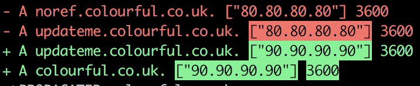

# SprinkleDNS

A diff-based way of managing DNS for people with lots of domains for AWS Route53.

## How

Use plain old Ruby to define your DNS configuration:

```ruby
require 'sprinkle_dns'

client = SprinkleDNS::Route53Client.new(ACCESS_KEY_ID, SECRET_ACCESS_KEY)
sdns   = SprinkleDNS::Client.new(client)

sdns.entry('A', 'www.billetto.com', '88.80.188.142', 360)
sdns.entry('A', 'staging.billetto.com', '88.80.188.143', 360)

sdns.sprinkle!
```

Or a more advanced example using loops and interpolation:

```ruby
require 'sprinkle_dns'

client = SprinkleDNS::Route53Client.new(ACCESS_KEY_ID, SECRET_ACCESS_KEY)
sdns   = SprinkleDNS::Client.new(client)

domains = ['billetto.dk', 'billetto.co.uk', 'billetto.com',  'billetto.se']

domains.each do |domain|
  sdns.entry('A', domain, '88.80.188.142', 360)
  sdns.entry('A', "www.#{domain}", '88.80.188.142', 360)

  s.entry("CNAME", "docs.#{domain}",  'ghs.googlehosted.com', 43200)
  s.entry("CNAME", "mail.#{domain}",  'ghs.googlehosted.com', 43200)
  s.entry("CNAME", "drive.#{domain}", 'ghs.googlehosted.com', 43200)

  s.entry("MX",    domain, ['1 aspmx.l.google.com',
                            '5 alt1.aspmx.l.google.com',
                            '5 alt2.aspmx.l.google.com',
                            '10 aspmx2.googlemail.com',
                            '10 aspmx3.googlemail.com'], 60)
end

# Overwrite one of the domains, to test our new loadbalancer:
sdns.entry('A', 'billetto.com', '89.81.189.143', 360)

sdns.sprinkle!
```

## Configuration

You can configure the `SprinkleDNS::Client` like so:

```ruby
client = SprinkleDNS::Route53Client.new(ACCESS_KEY_ID, SECRET_ACCESS_KEY)
sdns = SprinkleDNS::Client.new(client,
  dry_run: false,
  diff: true,
  force: true,
  delete: false,
  interactive_progress: true,
)
```

Here is a table that shows the different configuration options:

| Name                   | Description                                                                                               | Default value |
|------------------------|-----------------------------------------------------------------------------------------------------------|---------------|
| `dry_run`              | Do not make any changes, just compare and exit, useful with `diff: true`.                                 | `true`       |
| `diff`                 | Prints a diff to list the changes that are going to be made.                                              | `true`        |
| `force`                | Do not ask before changes are made, just apply.                                                           | `false`        |
| `delete`               | Specifies whether unreferenced entries should be deleted.                                                 | `false`       |
| `interactive_progress` | Shows interactive progress whilst changes are being applied, nice for your terminal, not for your CI-job. | `true`        |

### `dry_run` and `diff`

`dry_run` is useful combined with `diff` because it will let you see the changes in a safe manner without any changes being applied:



### `force: false`

With `force` being set to `false` you will be asked whether or not you want to apply the changes:


### `delete: true`

With `delete` being set to `true` SprinkleDNS will delete **any** entries not being referenced, these will also show up in the diff (if it is enabled):


## Support for ALIAS-records

Route53 supports ALIAS-records to achieve CNAME-flattening, SprinkleDNS also supports that, here we point our root domain to an ELB:

```ruby
require 'sprinkle_dns'

client = SprinkleDNS::Route53Client.new(ACCESS_KEY_ID, SECRET_ACCESS_KEY)
sdns   = SprinkleDNS::Client.new(client)

sdns.alias('A', 'billetto.com', 'Z215JYRZR1TBD5', 'dualstack.mothership-test-elb-546580691.eu-central-1.elb.amazonaws.com')

sdns.sprinkle!
```

## Amazon policy

This gem uses the following permissions to manage hosted zones:

- `route53:ListHostedZones`, for getting the list of hosted zones.
- `route53:ListResourceRecordSets`, to read the records for a hosted zone.
- `route53:ChangeResourceRecordSets`, to change records for a hosted zone.
- `route53:GetChange`, for reading when a change have been applied.

Additionally, you can consider adding the following permissions:

- `route53:CreateHostedZone`, for allowing the gem to create hosted zones.

You can allow it for all of your hosted zones:

```json
{
    "Version": "2012-10-17",
    "Statement": [
        {
            "Effect": "Allow",
            "Action": [
                "route53:ListResourceRecordSets",
                "route53:ChangeResourceRecordSets",
                "route53:GetChange",
                "route53:ListHostedZones"
            ],
            "Resource": [
                "*"
            ]
        }
    ]
}
```

For a more "locked down" policy you can use this (remember to update the `resource` array):

```json
{
    "Version": "2012-10-17",
    "Statement": [
        {
            "Effect": "Allow",
            "Action": [
                "route53:ListResourceRecordSets",
                "route53:ChangeResourceRecordSets"
            ],
            "Resource": [
                "arn:aws:route53:::hostedzone/Z3EATJAGJWXQE8"
            ]
        },
        {
            "Effect": "Allow",
            "Action": [
                "route53:GetChange",
                "route53:ListHostedZones"
            ],
            "Resource": [
                "*"
            ]
        }
    ]
}
```
